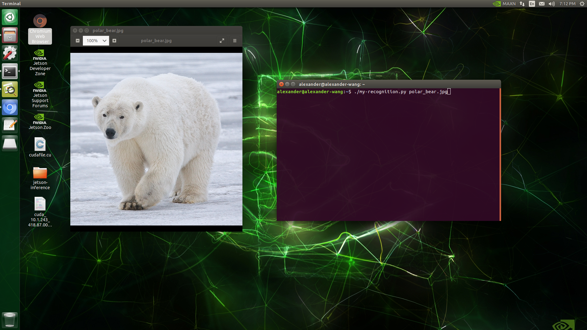
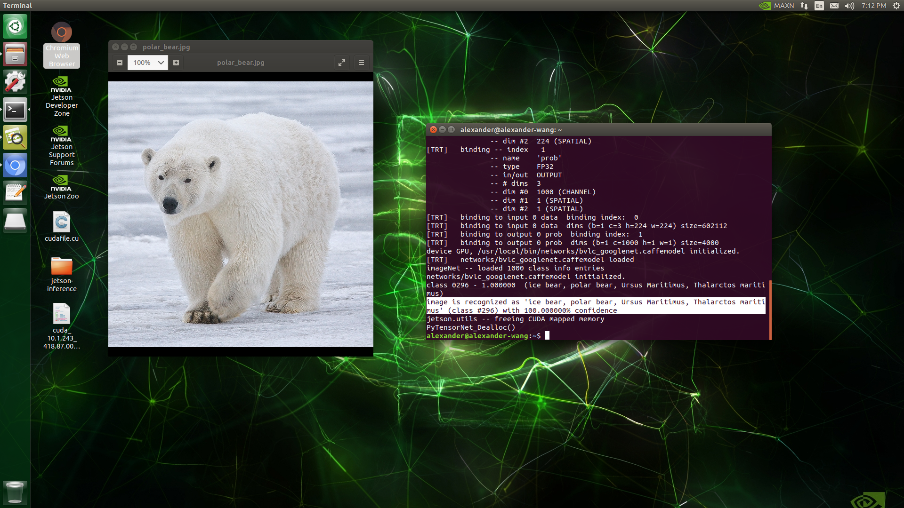

# ImageRecognition-HelloAIWorld-

Following the HelloAIWorld tutorial provided by Nvidia Jetson Projects page. Using the Jetson Nano, run a Python script that will take in an image and use a pretrained neural network to determine what the picture is.

